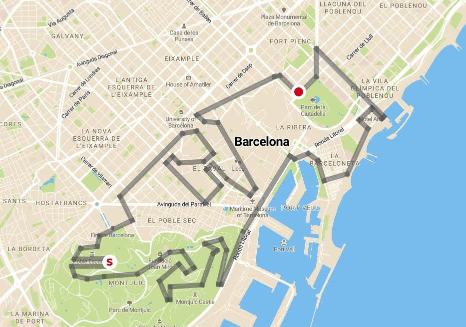

<script> 
    $(document).ready(function() { 
    $head = $('#header'); 
    $head.prepend('<A href = https://www.cuttingedge-events.com></A>') 
    }); 
</script> 


```{r setup, include=FALSE}
knitr::opts_chunk$set(echo = FALSE, message=FALSE, warning=FALSE)
```


```{r libraries}
library(readxl)
library(dplyr)
library(knitr)
library(timevis)

```

## Accommodation

### _**Main Hotel:**_

<iframe src="SBICARIA/SBICARIA.html" frameborder="0" width="100%" height="1250" scrolling="no"></iframe>

### **Alternative Hotels** {.tabset .tabset-fade .tabset-pills}

#### SB Glow

<iframe src="SB GLOW/SBGlow.html" frameborder="0" width="100%" height="1300" scrolling="no"></iframe>

#### Hotel Balmes

<iframe src="BALMES/Balmes.html" frameborder="0" width="100%" height="1200" scrolling="no"></iframe>

#### Hotel Gallery Barcelona

<iframe src="HOTEL GALLERY/GALLERY.html" frameborder="0" width="100%" height="1200" scrolling="no"></iframe>

#### Catalonia Diagonal Centro

<iframe src="CATALONIADIAGONALCENTRO/CataloniaDiagonalCentro.html" frameborder="0" width="100%" height="1200" scrolling="no"></iframe>

## Map

<iframe src="https://www.google.com/maps/d/u/0/embed?mid=1zSvvkhlNoiEhr-kbY01OfqNoqUUL6gUR" width="100%" height="480"></iframe>

<br>

## Programme

 **Programme Overview and timeline**

```{r timeline overview}

timeline <- read_excel("timeline.xlsx", sheet = "Sheet1", 
    col_types = c("date", 
        "text", "text", "numeric", "text", 
        "text"))

data <- data.frame( id = 1:length(timeline$start),
                    start = as.POSIXlt(timeline$start),
                    content = timeline$content,
                    group = timeline$group,
                    type = "box",
                    style = "background-color:#FF9933;")

groups = data.frame(id = 1:4, content = c("Morning", "Lunch", "Afternoon", "Diner"))

tl <- timevis(data, groups, showZoom = TRUE, zoomFactor = 0.2, fit = TRUE, width = '100%', height = 300)

tl %>% setOptions(list(orientation = "top", align = "left"))

```

### **DAY 1, May 14th**

Group will arrive at Barcelona's airport on May 14th. Our staff of will be waiting them for a meet and greet with the group. 
As long as they will be coming out of the airport, a bus with an english speaking guide will be waiting outside for a sightseeing tour. With this sightseeing tour, guests will enjoy the bests spots in Barcelona, such as Montjuic, Sagrada Familia, and the most emblemathic monuments in the city. 

* **Location** Barcelona
* **Duration** 3 hours   
* **Capacity** Minimum 10pax - maximum 50pax (per bus)
* **Included** Bus, english speaking guide.


When the activity is done, the bus will drop the people at the hotel to check in. Check in may take about 30 minutes. 
After this, a dinner at Vai Moana beach restaurant will be planned. 

<iframe src="VAI MOANA/VaiMoana.html" frameborder="0" width="100%" height="1100" scrolling="no"></iframe>

### **DAY 2, May 15th**

The second day in Barcelona will start with a morning meeting. It will take about 4 hours and a coffee break is included 2 hours after the beginning, more or less. 
Once the meeting has been done, guests will go lunch. 
We suggest two different restaurants, just 10 minutes by walk from the hotel SB Icaria.

#### Lunch options  {.tabset .tabset-fade}

##### Option 1: Cangrejo Loco

<iframe src="CANGREJO LOCO/ElcangrejoLoco.html" frameborder="0" width="100%" height="1150" scrolling="no"></iframe>

##### Option 2: Tinglado

<iframe src="TINGLADO/tinglado.html" frameborder="0" width="100%" height="1050" scrolling="no"></iframe>

#### Activity options  {.tabset .tabset-fade}

After the lunch, guests won't have too much time to rest or enjoy Barcelona by themselves. By 16:00 an activity will be planned. We suggest two different options.

##### Segway

Segway tour is an activity that combines the adrenaline by driving yourselve and the intrigue by discovering the most hidden spots in Barcelona's promenade. This activity takes about 2 hours and can start nearby hotel. 

* **Location** Barcelona
* **Duration** 2 hours   
* **Capacity** 50 pax 
* **Included** Segway renting, english speaking guide.


##### Go Cars

Discover Barcelona in a different way by driving special cars around the city. Go Cars is an activity destinated to those who likes non-common city tours. Guests will explore Barcelona by the road. Is a sightseeing tour but completely different to a common one. If guests want to drive, they must have a driving licence.
The duration of the activity is about 2-3 hours.

* **Location** Barcelona
* **Duration** 2 hours   
* **Capacity** 2 pax per car 
* **Included** Car renting, english speaking guide, insurances.

The route of the activity is this:



<br>


#### Dinner options {.tabset .tabset-fade}

At night, guests will enjoy a dinner at Barcelona's city centre restaurant Casa Carmen. They will have a bus at disposal for the dinner.

##### Casa Carmen

<iframe src="CASA CARMEN/CasaCarmen.html" frameborder="0" width="100%" height="1100" scrolling="no"></iframe>

##### Lomo Alto

<iframe src="LOMO ALTO/LomoAlto.html" frameborder="0" width="100%" height="1100" scrolling="no"></iframe>

### **DAY 3, May 16th**

On the third day we suggest you two different activities. Catamaran sailing or E-bike tour and lunch in a vineyard.

#### Activity options: {.tabset .tabset-fade}

##### Option 1: Catamarán sailing

Guests will enjoy barcelona skyline while sailing. Catamaan will sail along Barcelona coastline during the morning, so they will relax for some hours skipping all the bad vibes! The boat features sound system, bar, sunbathing areas and bathrooms. 
The lunch will be served in there, so they will taste Mediterranean barbacue while sailing. Non alcoholic drinks are included, but you have the option to upgrade to a open bar with beer and sangría.    
The activity will start by 10:00 and will be finishing by 13:00.

* **Location** Barcelona
* **Duration** 3 hours   
* **Capacity** 80 pax
* **Included** Boat renting, staff, barbacue, non alcoholic drinks, insurance. 

*Catamaran will be in exclusivity for the group*


After the activity free time till dinner time

##### Option 2: Ebike tour and lunch in a vineyard

We also recommend an E-bike tour from Barcelona city centre to Alella (small town 15km away. It can be to other place indeed), where guests will have a meal overlooking the mountains and the sea.
Group will ride along Barcelona's promenade and they will have a stop in Badalona beach (middle between) for a drink before arriving to Alella.
A truck will be following the group. If any bike is breaking down they will replace it immediatly. Once the group arrive there, they will load the bikes in the lorry and the bike activity will be finished. 

The winery and vineyards that they will visit is *Bouquet d'Alella* a family and sostenible winery of the area. After the visit they will have a picnic prepared up in the vineyards.

Once they had finished, a bus will be waiting down at the parking to pick up the group and go to Barcelona again.

* **Location** Barcelona - Alella
* **Duration** 5 hours aprox.   
* **Capacity** 50 pax 
* **Included** Bike tour (bikes renting, english speaking guide, bikes transportation), winery visit (wine tasting, picnic, english speaking guide) 


#### Dinner options {.tabset .tabset-fade}

We suggest two different restaurants for the last night. Both of them turns into a pub after dinning time.

##### Option 1: Shoko

<iframe src="SHOKO/Shoko.html" frameborder="0" width="100%" height="1100" scrolling="no"></iframe>

##### Option 2: Carpe Diem 

<iframe src="CDLC/cdlc.html" frameborder="0" width="100%" height="1150" scrolling="no"></iframe>

### **DAY 4, May 17th**

Depending on the departure time of the group we will suggest a restaurant for lunch time. This restaurants is Racó de la Vila. 

#### El Racó de la Vila

<iframe src="EL RACÓ DE LA VILA/El Racó de la Vila.html" frameborder="0" width="100%" height="1100" scrolling="no"></iframe>


END OF THE PROGRAMME

*****

## Budget {.tabset .tabset-fade .tabset-pills}

### Main Programme 

<iframe src="https://190819sbicariabudget.netlify.com/"  frameborder="0" width="100%" height="1650" scrolling="no"></iframe>

### Alternatives 

<iframe src="https://190819alternativesbudget.netlify.com/"  frameborder="0" width="100%" height="1800" scrolling="no"></iframe>

## Terms & Conditions

  * Rates valid for 2020.
  
  * For a group of minimum 35 pax.
  
  * Management fee including in the detailed rates
  
  * VAT included. 
  
  * No reservation has been done. Availability upon request.
  
*****


