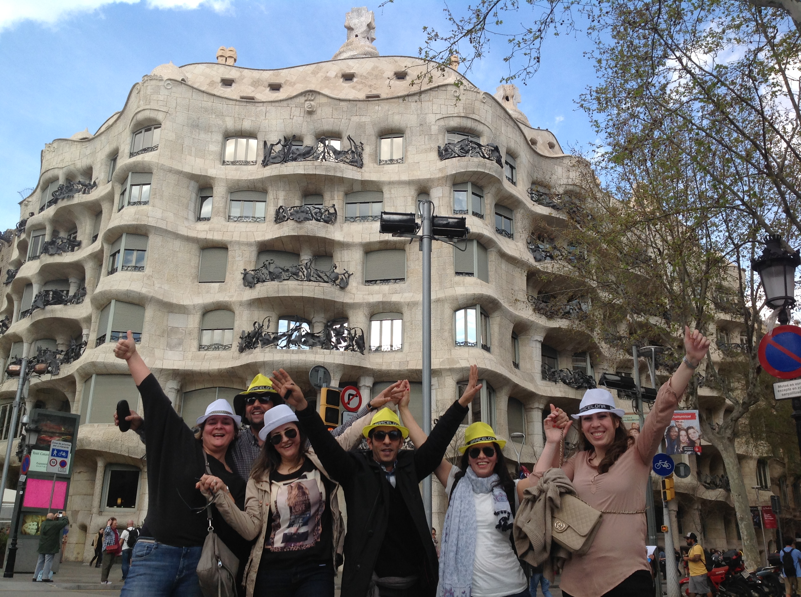

<script> 
    $(document).ready(function() { 
    $head = $('#header'); 
    $head.prepend('<A href = http://www.bettertravel.dk/en/></A>') 
    }); 
</script> 


```{r setup, include=FALSE}
knitr::opts_chunk$set(echo = FALSE, message=FALSE, warning=FALSE)
```


```{r libraries}
library(readxl)
library(dplyr)
library(knitr)
library(timevis)

```

## Accommodation

### _**Main Hotel:**_

<iframe src="SBICARIA/SBICARIA.html" frameborder="0" width="100%" height="1250" scrolling="no"></iframe>

The proposed meeting room is called **Mar Bella** and it has 80m2 it has a capacity for 35 in school set-up. It doesn't have daylight. The rates are including WIFI, pens, screen and projector.


### **Alternative Hotels** {.tabset .tabset-fade .tabset-pills}

#### SB Glow

<iframe src="SB GLOW/SBGlow.html" frameborder="0" width="100%" height="1300" scrolling="no"></iframe>

#### Hotel Balmes

<iframe src="BALMES/Balmes.html" frameborder="0" width="100%" height="1200" scrolling="no"></iframe>

#### Hotel Gallery Barcelona

<iframe src="HOTEL GALLERY/GALLERY.html" frameborder="0" width="100%" height="1200" scrolling="no"></iframe>

#### Catalonia Diagonal Centro

<iframe src="CATALONIADIAGONALCENTRO/CataloniaDiagonalCentro.html" frameborder="0" width="100%" height="1200" scrolling="no"></iframe>

## Map

<iframe src="https://www.google.com/maps/d/embed?mid=1zSvvkhlNoiEhr-kbY01OfqNoqUUL6gUR&hl=es" width="100%" height="550"></iframe>

<br>

## Programme


### **DAY 1, May 14th**  

Group will arrive at Barcelona's airport on May 14th in the morning. Our staff of will be waiting them for a meet and greet with the group and they will be transfered to hotel SB Icaria.

They will let their luggage in the hotel and they will have lunch

####  Lunch Options: {.tabset .tabset-fade}

##### Option 1: At the Hotel

The hotel offer different options, it can be a seated three- courses menu seated even in the indoor restaurant or a cocktail lunch in the chill-out area next to the swimming pool.


##### Option 2: Racó de la Vila

They will walk less than 10 minutes to find this traditional restaurant:

<iframe src="EL RACÓ DE LA VILA/El Racó de la Vila.html" frameborder="0" width="100%" height="1100" scrolling="no"></iframe>


####  Activity Options: {.tabset .tabset-fade}

##### iPad Treasure Hunt

This is a customized activity that we created specially for each group. 
We will split them in 7 teams of 5 pax. Each team will have an iPad and a bag with city maps, metro cards, water and some extra materials that they will need during the activity.

Before start the race, we will do a briefing explaining the instructions to the captians. Each group will have to choose its own strategy to win. They will need to pass different kind of challenges (we can include special challenges related with the client's company). 

We will create a website with the instructions, maps, etc and they will have to use their iPad to take the pictures and videos. The Final spot will be on a set time in a bar located in the city centre were they will deliver the iPads to the orgainzation staff and they will be invited to enjoy a drink and wait for their colleagues.

After having a drink they will have free time until dinner.

* **Location** Barcelona
* **Duration** 4 hours   
* **Capacity** from 20 to 200 pax
* **Included** iPad rental, activity design and organization, material needed, public transportation cards (2 per team - 20 oneway trips), one drink and an award for the winner team.

The organization will announce the winner team after dinner and we will edit a video with all the pictures and videos that will be delivered 1 week after the event.



<iframe src="https://player.vimeo.com/video/204382207" width="100%" height="550" frameborder="0" allow="autoplay; fullscreen" allowfullscreen></iframe>


##### Go Cars

They will walk from the hotel (or from Racó de la Vila) around 20 minutes to arrive to the GoCars shop. 

Discover Barcelona in a different way by driving special cars around the city. Go Cars is an activity destinated to those who likes non-common city tours. Guests will explore Barcelona by the road. Is a sightseeing tour but completely different to a common one. If guests want to drive, they must have a driving licence.
The duration of the activity is about 2 hours.

* **Location** Barcelona
* **Duration** 2 hours   
* **Capacity** 2 pax per car 
* **Included** Car renting, english speaking guide, insurances.

The route of the activity is this:


<br>


The tour starts and ends at the same spot: the GoCars Shop just next to Arc del Triomf. 
From this spot guests can take a walk to visit the Born Quarter, full of narrow streets with beautiful squares and bars to have a drink in every corner.


####  Dinner Options: {.tabset .tabset-fade}

##### Option 1: Taller de Tapas Rambla catalunya

This restaurant is located in the city centre so, guests will meet there directly at a set time.

<iframe src="TALLER DE TAPAS/Taller de Tapas.html" frameborder="0" width="100%" height="1150" scrolling="no"></iframe>

##### Option 2: Vai Moana

This beach bar is located just on the sand, is a relaxed option to enjoy the sunset on the beach with a nice cocktail menu and a mojito.

<iframe src="VAI MOANA/VaiMoana.html" frameborder="0" width="100%" height="1100" scrolling="no"></iframe>

### **DAY 2, May 15th**

The second day in Barcelona will start with a morning meeting. It will take about 4 hours and a coffee break is included 2 hours after the beginning, more or less. 
Once the meeting has been done, guests will go lunch. 
We suggest two different restaurants, just 10 minutes by walk from the hotel SB Icaria.

#### Lunch options  {.tabset .tabset-fade}

##### Option 1: Cangrejo Loco

<iframe src="CANGREJO LOCO/ElcangrejoLoco.html" frameborder="0" width="100%" height="1150" scrolling="no"></iframe>

##### Option 2: Tinglado

<iframe src="TINGLADO/tinglado.html" frameborder="0" width="100%" height="1050" scrolling="no"></iframe>


#### Afternoon Activity: Segway Tour

After the lunch, guests will be invited to enjoy a new and funny way to visit the city sea front promenade and the Barceloneta quarter. The tour will start just 10 minutes walking from the lunch restaurant and it will finish at Arc del Triomf. 

Segway tour is an activity that combines the adrenaline by driving yourselve and the intrigue by discovering the most hidden spots in Barcelona's promenade. This activity takes about 2 hours 

* **Location** Barcelona
* **Duration** 2 hours   
* **Capacity** 50 pax 
* **Included** Segway renting, english speaking guide.


#### Dinner options {.tabset .tabset-fade}

The activity will finish at Arc del Triomf (almost same spot GoCar finish), from this spot to Plaza Catalunya there are around 15 to 20 minutes by foot, so the idea is that they will have some free time to go around shopping or visiting and then they will meet at a set time in Casa Carmen or Lomo Alto. Both restaurants are located at Eixample Quarter.

After dinner they will need a oneway bus transfer back to the hotel but if someone wants to stay they will find a lot of bars and places to have a drink and then they can take a taxi to the hotel easily in Plaza Catalunya's Taxi stop

##### Casa Carmen

<iframe src="CASA CARMEN/CasaCarmen.html" frameborder="0" width="100%" height="1100" scrolling="no"></iframe>

##### Lomo Alto

<iframe src="LOMO ALTO/LomoAlto.html" frameborder="0" width="100%" height="1100" scrolling="no"></iframe>

### **DAY 3, May 16th**

On the third day we suggest you two different activities. Catamaran sailing or E-bike tour and lunch in a vineyard.

#### Activity options: {.tabset .tabset-fade}

##### Option 1: Catamarán sailing

Guests will enjoy barcelona skyline while sailing. Catamaan will sail along Barcelona coastline during the morning, so they will relax for some hours skipping all the bad vibes! The boat features sound system, bar, sunbathing areas and bathrooms. 
The lunch will be served in there, so they will taste Mediterranean barbacue while sailing. Non alcoholic drinks are included, but you have the option to upgrade to a open bar with beer and sangría.    


The activity will start by 10:00 and will be finishing by 13:00, the spot were guests will find the Catamaran is around 15 minutes from the hotel by foot.

* **Location** Barcelona
* **Duration** 3 hours   
* **Capacity** 80 pax
* **Included** Boat renting, staff, BBQ menu, non alcoholic drinks, insurance. 

*Catamaran will be in exclusivity for the group*


After the activity free time till dinner time

##### Option 2: Ebike tour and lunch in a vineyard

We also recommend an E-bike tour from Barcelona city centre to Alella (small town 15km away. It can be to other place indeed), where guests will have a meal overlooking the mountains and the sea.
Group will start just in front the hotel and then they will ride along Barcelona's promenade and they will have a stop in Badalona beach (middle between) for a drink before arriving to Alella.

A truck will be following the group. If any bike is breaking down they will replace it immediatly. Once the group arrive there, they will load the bikes in the lorry and the bike activity will be finished. 

The winery and vineyards that they will visit is *Bouquet d'Alella* a family and sostenible winery of the area. After the visit they will have a picnic prepared up in the vineyards.

Once they had finished, a bus will be waiting down at the parking to pick up the group and go to Barcelona again.

* **Location** Barcelona - Alella
* **Duration** 5 hours aprox.   
* **Capacity** 50 pax 
* **Included** Bike tour (bikes renting, english speaking guide, bikes transportation), winery visit (wine tasting, picnic, english speaking guide) 


#### Dinner options {.tabset .tabset-fade}

We suggest two different restaurants for the last night. Both of them turns into a pub after dinning time and both are walking distance from the hotel.

##### Option 1: Shoko

<iframe src="SHOKO/Shoko.html" frameborder="0" width="100%" height="1100" scrolling="no"></iframe>

##### Option 2: Carpe Diem 

<iframe src="CDLC/cdlc.html" frameborder="0" width="100%" height="1150" scrolling="no"></iframe>

### **DAY 4, May 17th**

After having breakfast at the hotel the group will do the check-out and they will be transferred to the Airport.


END OF THE PROGRAMME

*****

## Budget {.tabset .tabset-fade .tabset-pills}

### Main Programme 

<iframe src="https://190819sbicariabudget.netlify.com/"  frameborder="0" width="100%" height="1750" scrolling="no"></iframe>

### Alternatives 

<iframe src="https://190819alternativesbudget.netlify.com/"  frameborder="0" width="100%" height="1400" scrolling="no"></iframe>

## Terms & Conditions

  * Rates valid for 2020.
  
  * For a group of minimum 35 pax.
  
  * Management fee including in the detailed rates
  
  * VAT included. 
  
  * No reservation has been done. Availability upon request.
  
*****


